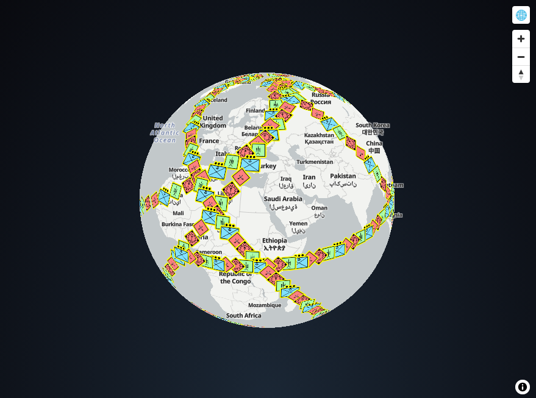

# MapLibre animation experiment

Try it online at https://orbat-mapper.github.io/experiment-maplibre-animations/

[Open in CodeSandbox](https://githubbox.com/orbat-mapper/experiment-maplibre-animations)

Screenshot:

## Getting started

Clone repo:

    $ git clone https://github.com/orbat-mapper/experiment-maplibre-animations.git

Navigate to project root:

    $ cd experiment-maplibre-animations

Install dependencies:

    $ npm install

To start a development server run:

    $ npm run dev

The demo is now running on http://localhost:5173/.
